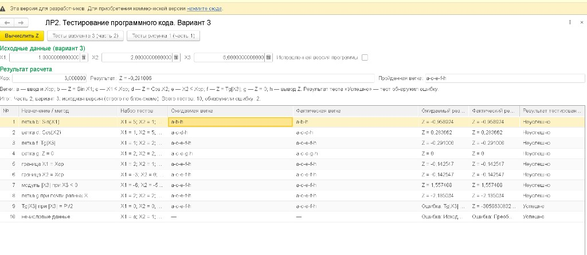
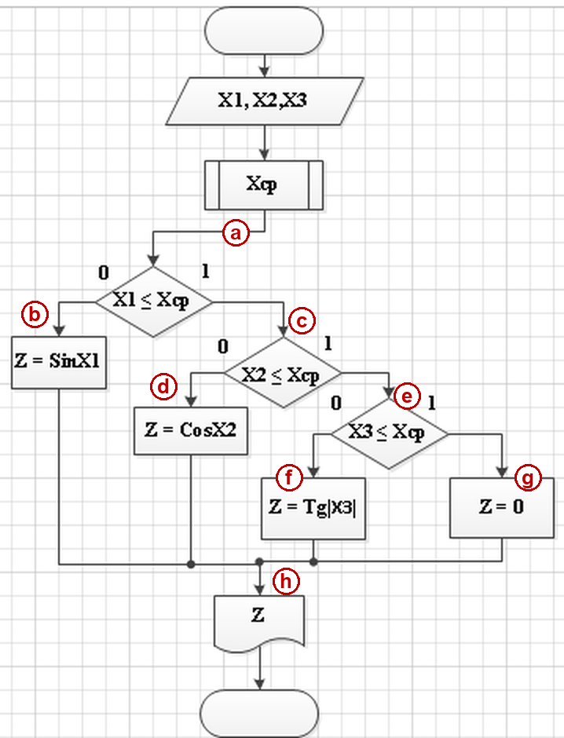
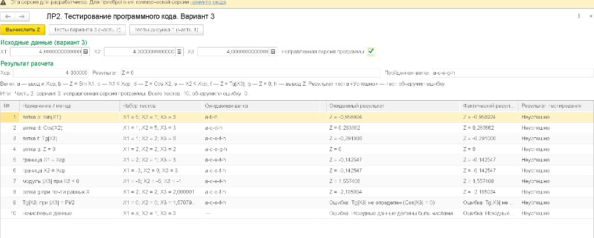
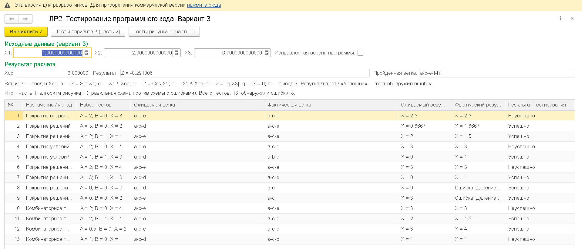

# ЛР2. Тестирование программного кода (вариант 3) — внешняя обработка 1С

> **Об авторстве.** Внешняя обработка и код в этом репозитории написаны ИИ-ассистентом (Cursor) под руководством **Гоглова Артёма Ивановича**, студента группы **4ИСП**.

Лабораторная работа №2 по МДК 06.02 «Выявление и устранение ошибок программного кода информационных систем». Задание выполнено на встроенном языке 1С в виде внешней обработки для 1С:Предприятия 8.3 / 8.5 (управляемое приложение).

Готовый файл для запуска: **[ЛР2Вариант3.epf](./ЛР2Вариант3.epf)** (откройте ссылку и нажмите справа кнопку **Download raw file**).



---

## Что делает обработка

**Часть 1: алгоритм рисунка 1 из методических указаний.** Алгоритм реализован в двух вариантах: правильный (рис. 1, а) и с внесёнными ошибками (рис. 1, б), где «И» заменено на «ИЛИ», а `X > 1` на `X < 1`. На обоих вариантах запускаются тесты пяти методов структурного покрытия:

- покрытие операторов;
- покрытие решений;
- покрытие условий;
- покрытие решений/условий;
- комбинаторное покрытие условий.

Ожидаемый результат считается по правильной схеме, фактический — по схеме с ошибками. Для каждого теста выводится пройденный путь: `a-c-e`, `a-b-d` и т. д.

**Часть 2: вариант 3.** Вводятся числа X1, X2, X3, вычисляется среднее `Xср = (X1 + X2 + X3) / 3`:

- если `X1 > Xср`, то `Z = sin X1`;
- иначе, если `X2 > Xср`, то `Z = cos X2`;
- иначе, если `X3 > Xср`, то `Z = tg|X3|`;
- иначе `Z = 0`.

Программа показывает, по какой ветке блок-схемы она прошла. Тесты «белого ящика» проверяют все пути, граничные значения и некорректные данные. Флажок **«Исправленная версия программы»** включает версию, в которой найденные ошибки исправлены.



Ветки: **a** — ввод и вычисление Xср; **b** — `Z = sin X1`; **c** — `X1 ≤ Xср`; **d** — `Z = cos X2`; **e** — `X2 ≤ Xср`; **f** — `Z = tg|X3|`; **g** — `Z = 0`; **h** — вывод Z.

---

## Как открыть

1. Скачайте `ЛР2Вариант3.epf`.
2. Запустите 1С:Предприятие и откройте любую базу (подойдёт и пустая).
3. Выберите **Файл → Открыть…** и укажите скачанный файл.
4. На вопрос системы безопасности ответьте **«Да»**.

## Что есть на форме

| Элемент | Назначение |
|---------|------------|
| **X1, X2, X3** | Исходные данные варианта 3 |
| **Исправленная версия программы** | Переключает исходную и исправленную версию |
| **Вычислить Z** | Считает Xср, Z и показывает пройденную ветку |
| **Тесты варианта 3 (часть 2)** | Заполняет таблицу тестами варианта 3 |
| **Тесты рисунка 1 (часть 1)** | Заполняет таблицу тестами методов покрытия |

В таблице **«Успешно»** означает, что тест **обнаружил ошибку**, «Неуспешно» — что ошибок не найдено. Так принято в методических указаниях.

---

## Результаты

### Часть 2, исходная версия: ошибку нашли 2 теста из 10

| № | Что проверяется | Данные | Ветка | Ожидаемый результат | Фактический результат | Итог |
|---|-----------------|--------|-------|---------------------|-----------------------|------|
| 1 | ветка b | 5; 1; 3 | a-b-h | Z = −0,958924 | Z = −0,958924 | Неуспешно |
| 2 | ветка d | 1; 5; 3 | a-c-d-h | Z = 0,283662 | Z = 0,283662 | Неуспешно |
| 3 | ветка f | 1; 2; 6 | a-c-e-f-h | Z = −0,291006 | Z = −0,291006 | Неуспешно |
| 4 | ветка g | 2; 2; 2 | a-c-e-g-h | Z = 0 | Z = 0 | Неуспешно |
| 5 | граница X1 = Xср | 2; 1; 3 | a-c-e-f-h | Z = −0,142547 | Z = −0,142547 | Неуспешно |
| 6 | граница X2 = Xср | −3; 0; 3 | a-c-e-f-h | Z = −0,142547 | Z = −0,142547 | Неуспешно |
| 7 | модуль при X3 < 0 | −6; −5; −1 | a-c-e-f-h | Z = 1,557408 | Z = 1,557408 | Неуспешно |
| 8 | почти равные числа | 2; 2; 2,000001 | a-c-e-f-h | Z = −2,185034 | Z = −2,185034 | Неуспешно |
| 9 | tg при X3 = π/2 | 0; 0; π/2 | a-c-e-f-h | сообщение «tg не определён» | Z ≈ −3,06·10¹⁴ | **Успешно** |
| 10 | буква вместо числа | а; 1; 3 | — | сообщение «введите числа» | системная ошибка 1С | **Успешно** |

Найденные ошибки:

- в точке X3 = π/2 тангенс не существует, а программа выдаёт огромное число;
- программа не проверяет, что введены именно числа.

Ветка g (`Z = 0`) достижима только при `X1 = X2 = X3`, поэтому она почти «мёртвая».

### Часть 2, исправленная версия: ошибок не найдено

В исправленной версии добавлены проверка типа данных и проверка `Cos|X3| ≠ 0` перед вычислением тангенса.



### Часть 1: ошибку нашли 8 тестов из 13



Покрытие операторов не нашло ни одной ошибки. Покрытие решений, условий, решений/условий и комбинаторное покрытие находят ошибки. В тесте `A = 1, B = 0, X = 1` результат совпал, но пути разные (`a-b-d` и `a-c-d`): ошибка есть, но по ответу её не видно.

---

## Состав репозитория

| Путь | Что это |
|------|---------|
| `ЛР2Вариант3.epf` | Готовая внешняя обработка |
| `ЛР2Вариант3.xml`, `ЛР2Вариант3/` | Исходники обработки (выгрузка в XML) |
| `ЛР2Вариант3/Ext/ObjectModule.bsl` | Модуль объекта: алгоритмы и тесты |
| `ЛР2Вариант3/Forms/Форма/Ext/Form/Module.bsl` | Модуль формы |
| `onescript/` | Тот же алгоритм в виде консольных сценариев для [OneScript](https://github.com/EvilBeaver/OneScript) |
| `docs/` | Скриншоты и блок-схема для README |

## Сборка из исходников

Через конфигуратор: **Файл → Загрузить внешнюю обработку, отчёт из файлов…**, выберите `ЛР2Вариант3.xml` и сохраните результат как `.epf`.

Или командой:

```
1cv8.exe DESIGNER /F "<путь к любой файловой базе>" /LoadExternalDataProcessorOrReportFromFiles "ЛР2Вариант3.xml" "ЛР2Вариант3.epf"
```

## Запуск версии для OneScript

```
oscript onescript/ЛР2_часть1_рисунок1.os
oscript onescript/ЛР2_часть2_вариант3.os
```
